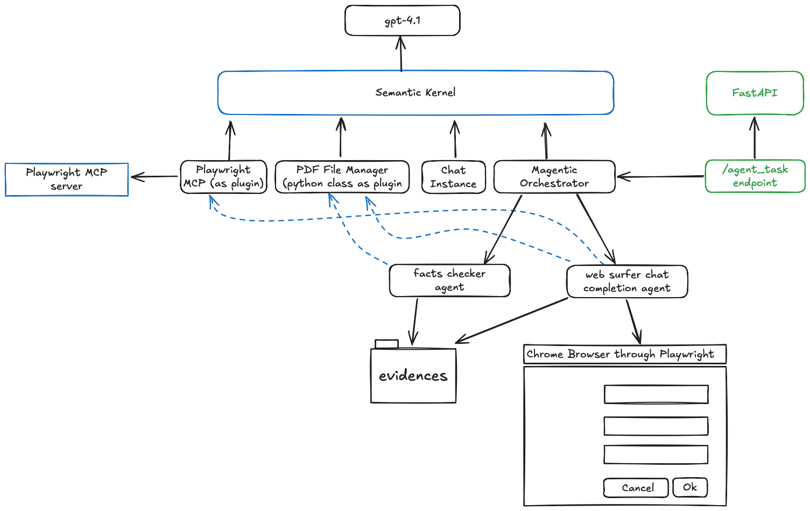

# Agentic WebSurfer with Semantic Kernel
Multi-agent architecture using Magentic Orchestration from Semantic Kernel

## Table of Contents
- [Overview](#overview)
   - [Components deployed](#components-deployed)
- [Prerequisites](#prerequisites)
- [Installation](#installation)
   - [Configuration](#configuration)
   - [Local Development](#local-development)
   - [Run playwright MCP](#run-playwright-mcp)
   - [Run the application](#run-the-application)
   - [Docker](#docker)
- [Usage](#usage)
   - [API Endpoints](#api-endpoints)
   - [Available Agents](#available-agents)
- [Security](#security)
- [Contributing](#contributing)
- [License](#license)

## Overview
This project implements a multi-agent system using Magentic Orchestration from Semantic Kernel, deployed on a docker image. The system receives a playload, for instance in JSON format, and uses semantic to fulfill the form and collect evidence.



### Components deployed

 - Webhook: service that publishes the webhook endpoint to receive the JSON with the payload to fullfil the form.
 - mas: Multi-Agent System responsible to implement the webhook to receive the JSON with the payload and implement the Semantic Kernel (kernel, magentic orchestration, agents and tools).

## Prerequisites
- Python 3.13.2
- Docker (optional)
- Azure account with OpenAI service

## Installation

### Configuration
Create a `.env` file based on `.env.example` with your configuration:

```bash
# Server Configuration
PORT=8080
ENVIRONMENT=dev

# Azure OpenAI Configuration
AZURE_OPENAI_DEPLOYMENT=your-deployment-name
AZURE_OPENAI_MODEL=your-model-name
AZURE_OPENAI_API_VERSION=your-model-api-version
AZURE_OPENAI_ENDPOINT=https://your-endpoint.openai.azure.com/
AZURE_OPENAI_API_KEY=your-api-key
LLM_MODEL_SCOPE=https://cognitiveservices.azure.com/.default

# Agents Configuration
OUTPUT_DIR=output-directory-for-playwright-screenshots
```

### Local Development
1. Clone the repository
2. Create a virtual environment:
   ```bash
   python -m venv venv
   source venv/bin/activate  # On Windows: venv\Scripts\activate
   ```
3. Install dependencies:
   ```bash
   pip install -r requirements.txt
   ```

### Run playwright MCP
1. Run the MCP server
   ```bash
   npx @playwright/mcp@latest --port 9339 --isolated
   ```
   You can run the browser headless too:
   ```bash
   npx @playwright/mcp@latest --port 9339 --isolated --headless
   ```

   Check all possible options here: https://github.com/microsoft/playwright-mcp/tree/main/utils

### Run the application

```
python /src/main.py
```

### Docker

The docker image contains playwright mcp, chrome browser and the app.

1. Build the image:
   ```bash
   docker build -t mas-app .
   ```
2. Run the container:
   ```bash
   docker run --env-file .env -p 8080:8080 mas-app
   ```


## Usage

### API Endpoints

Either running as a local app for development or docker image, the scenario is the same as follows:

- POST `/agent_task`: Submit a task for the agents to process
  ```bash
  curl -X POST http://localhost:8080 \
    -H "Content-Type: application/json" \
    -d '{"First name": "Firstson","Middle name": "","Last name": "Lastshore","Phone number": "55 11 12345 6789","Street address": "One Microsoft Avenue","City": "Redmond","State": "Washington","ZIP": "98052","Country": "United States"}'
  ```

### Available Agents

The system implements two specialized agents that work together:

**Web Surfer Specialist**: An expert in web navigation that uses Playwright MCP tools to navigate and extract content from web pages. This agent is responsible for interacting with web forms, extracting form fields, and handling web automation tasks.

**Facts Checker**: A specialized agent that uses various tools and resources to validate information. This agent is responsible for verifying the accuracy of data, ensuring all required information is present, and validating form submission responses.

The agents work collaboratively under the Magentic Orchestration from Semantic Kernel, with each agent focusing on its specialized task while contributing to the overall goal.


## Security
- All sensitive information should be stored in environment variables
- Use Azure Key Vault for production secrets
- Follow the principle of least privilege
- Regularly rotate API keys and credentials
- Monitor and audit access to sensitive resources

## Contributing
Please read [CONTRIBUTING.md](CONTRIBUTING.md) for details on our code of conduct and the process for submitting pull requests.

## License
This project is licensed under the MIT License - see the [LICENSE](LICENSE) file for details.
